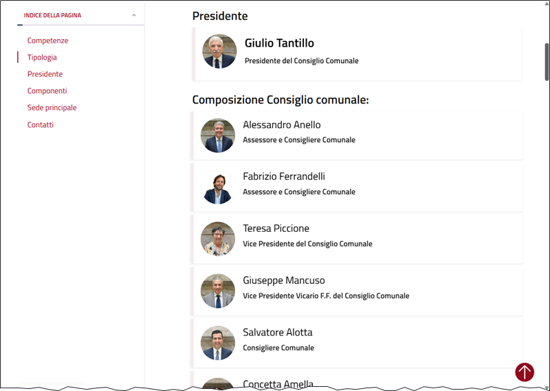

---
search:
  exclude: true
---

--8<-- "includes/lavori_in_corso.md"

# Gli schemi

Molti LLM consentono di produrre output strutturati, in formato JSON e altri formati. La funzione `schema` di `llm` consente di definire uno schema per l'*output* che si desidera ottenere.

## Creare dati a partire da uno schema

Molto spesso è utile creare dei dati di esempio a partire da uno schema. Con `llm` basta lanciare un comando come il seguente, con l'opzione `--schema`:

```bash {.wordwrap-code}
llm --schema 'nome, citta, indirizzo,posti_a_sedere int' 'crea un ristorante italiano'
```

In output si avrà un JSON come questo:

```json
{
  "citta": "Roma",
  "indirizzo": "Via del Corso, 123",
  "nome": "Bella Italia",
  "posti_a_sedere": 50
}
```

È molto più utile creare un set di dati, creare più ristoranti. L'opzione è `--schema-multi`:

```bash {.wordwrap-code}
llm --schema-multi 'nome, citta, indirizzo,posti_a_sedere int' 'crea 5 ristoranti italiani'
```

In output si avrà un JSON come questo:

```json
{
  "items": [
    {
      "citta": "Roma",
      "indirizzo": "Via del Corso 123",
      "nome": "La Pergola",
      "posti_a_sedere": 80
    },
    {
      "citta": "Firenze",
      "indirizzo": "Piazza della Signoria 45",
      "nome": "Trattoria Mario",
      "posti_a_sedere": 60
    },
    {
      "citta": "Venezia",
      "indirizzo": "Calle del Traghetto 78",
      "nome": "Osteria Alle Testiere",
      "posti_a_sedere": 40
    },
    {
      "citta": "Milano",
      "indirizzo": "Via Montenapoleone 90",
      "nome": "Il Salumaio di Montenapoleone",
      "posti_a_sedere": 100
    },
    {
      "citta": "Napoli",
      "indirizzo": "Via Tribunali 22",
      "nome": "L'Antica Pizzeria da Michele",
      "posti_a_sedere": 50
    }
  ]
}
```

## Estrarre dati a partire da uno schema

Oltre a generare dati inventati, è possibile estrarre dati a partire da un testo (una pagina web, un documento, un log di un programma), utilizzando uno schema.

Un esempio potrebbe essere quello di estrarre, nome, ruolo, sesso, URL della pagina web, delle **persone** che compongono un **consiglio comunale**. Come esempio quello del comune di Palermo (notare che il sesso sarà estratto in modo automatico, e non è presente nella pagina web).



Basta passare il codice `HTML` della pagina web a `llm` con l'opzione `--schema-multi`, specificando lo schema che si desidera ottenere:

```bash {.wordwrap-code}
curl -kL "https://www.comune.palermo.it/amministrazione/unita_organizzativa/consiglio-comunale-3/" | \
llm --schema-multi "
nome: il nome del consigliere
ruolo: il ruolo
url: url della pagina del consigliere
sesso: m per maschio f per femmina NA per dubbio o inapplicabile
" --system 'estrai i dati dei consiglieri comunali presenti nella pagina web'
```

In output si avrà un JSON come questo:

```json
{
  "items": [
    {
      "nome": "Giulio Tantillo",
      "ruolo": "Presidente del Consiglio Comunale",
      "sesso": "m",
      "url": "https://www.comune.palermo.it/persona_pubblica/giulio-tantillo-2/"
    },
    {
      "nome": "Alessandro Anello",
      "ruolo": "Assessore e Consigliere Comunale",
      "sesso": "m",
      "url": "https://www.comune.palermo.it/persona_pubblica/alessandro-anello/"
    },
    {
      "nome": "Fabrizio Ferrandelli",
      "ruolo": "Assessore e Consigliere Comunale",
      "sesso": "m",
      "url": "https://www.comune.palermo.it/persona_pubblica/fabrizio-ferrandelli/"
    },
    {
      "nome": "Teresa Piccione",
      "ruolo": "Vice Presidente del Consiglio Comunale",
      "sesso": "f",
      "url": "https://www.comune.palermo.it/persona_pubblica/teresa-piccione/"
    },
...
```

## Estrarra dati dal DB di LLM cli

L'*output* di un'estrazione dati tramite schema, oltre a essere visualizzato nel terminale, viene salvato nel [db `SQLite` di *log*](log.md) di `llm`.

Per estrarre i dati dal log, dell'**ultima conversazione** basta lanciare il comando:

```bash {.wordwrap-code}
llm logs -c --data
```

L'opzione `-c` serve a estrarre dalla conversazione più recente, e l'opzione `--data` serve a estrarre i dati in formato JSON. Qui sotto un esempio di *output*.

??? example "Esempio di output"
    ```json {.wordwrap-code}
    {"items": [{"nome": "Giulio Tantillo", "ruolo": "Presidente del Consiglio Comunale", "sesso": "m", "url": "https://www.comune.palermo.it/persona_pubblica/giulio-tantillo-2/"}, {"nome": "Alessandro Anello", "ruolo": "Assessore e Consigliere Comunale", "sesso": "m", "url": "https://www.comune.palermo.it/persona_pubblica/alessandro-anello/"}, {"nome": "Fabrizio Ferrandelli", "ruolo": "Assessore e Consigliere Comunale", "sesso": "m", "url": "https://www.comune.palermo.it/persona_pubblica/fabrizio-ferrandelli/"}, {"nome": "Teresa Piccione", "ruolo": "Vice Presidente del Consiglio Comunale", "sesso": "f", "url": "https://www.comune.palermo.it/persona_pubblica/teresa-piccione/"}, {"nome": "Giuseppe Mancuso", "ruolo": "Vice Presidente Vicario F.F. del Consiglio Comunale", "sesso": "m", "url": "https://www.comune.palermo.it/persona_pubblica/giuseppe-mancuso/"}, {"nome": "Salvatore Alotta", "ruolo": "Consigliere Comunale", "sesso": "m", "url": "https://www.comune.palermo.it/persona_pubblica/salvatore-alotta-2/"}, {"nome": "Concetta Amella", "ruolo": "Consigliere Comunale", "sesso": "f", "url": "https://www.comune.palermo.it/persona_pubblica/concetta-amella/"}, {"nome": "Rosario Arcoleo", "ruolo": "Consigliere Comunale", "sesso": "m", "url": "https://www.comune.palermo.it/persona_pubblica/rosario-arcoleo/"}, {"nome": "Giulia Argiroffi", "ruolo": "Consigliere Comunale", "sesso": "f", "url": "https://www.comune.palermo.it/persona_pubblica/giulia-argiroffi/"}, {"nome": "Domenico Bonanno", "ruolo": "Consigliere Comunale", "sesso": "m", "url": "https://www.comune.palermo.it/persona_pubblica/domenico-bonanno/"}, {"nome": "Leonardo Canto", "ruolo": "Consigliere Comunale", "sesso": "m", "url": "https://www.comune.palermo.it/persona_pubblica/leonardo-canto/"}, {"nome": "Germana Canzoneri", "ruolo": "Consigliere Comunale", "sesso": "f", "url": "https://www.comune.palermo.it/persona_pubblica/germana-canzoneri/"}, {"nome": "Dario Chinnici", "ruolo": "Consigliere Comunale", "sesso": "m", "url": "https://www.comune.palermo.it/persona_pubblica/dario-chinnici/"}, {"nome": "Valentina Chinnici", "ruolo": "Consigliere Comunale dimissionaria in data 13/02/2023", "sesso": "f", "url": "https://www.comune.palermo.it/persona_pubblica/valentina-chinnici/"}, {"nome": "Tiziana D'Alessandro", "ruolo": "Consigliere Comunale", "sesso": "f", "url": "https://www.comune.palermo.it/persona_pubblica/tiziana-dalessandro/"}, {"nome": "Mariangela Di Gangi", "ruolo": "Consigliere Comunale", "sesso": "f", "url": "https://www.comune.palermo.it/persona_pubblica/mariangela-di-gangi/"}, {"nome": "Salvatore Di Maggio", "ruolo": "Consigliere Comunale surroga del consigliere Caronia Anna Maria", "sesso": "m", "url": "https://www.comune.palermo.it/persona_pubblica/salvatore-di-maggio/"}, {"nome": "Sabrina Figuccia", "ruolo": "Consigliere Comunale", "sesso": "f", "url": "https://www.comune.palermo.it/persona_pubblica/sabrina-figuccia/"}, {"nome": "Salvatore Forello", "ruolo": "Consigliere Comunale", "sesso": "m", "url": "https://www.comune.palermo.it/persona_pubblica/salvatore-forello/"}, {"nome": "Massimiliano Giaconia", "ruolo": "Consigliere Comunale", "sesso": "m", "url": "https://www.comune.palermo.it/persona_pubblica/massimiliano-giaconia/"}, {"nome": "Fabio Giambrone", "ruolo": "Consigliere Comunale", "sesso": "m", "url": "https://www.comune.palermo.it/persona_pubblica/fabio-giambrone/"}, {"nome": "Salvatore Imperiale", "ruolo": "Consigliere Comunale", "sesso": "m", "url": "https://www.comune.palermo.it/persona_pubblica/salvatore-imperiale/"}, {"nome": "Giovanni Inzerillo", "ruolo": "Consigliere Comunale", "sesso": "m", "url": "https://www.comune.palermo.it/persona_pubblica/giovanni-inzerillo/"}, {"nome": "Teresa Leto", "ruolo": "Consigliere Comunale surroga del consigliere Fabrizio Ferrara", "sesso": "f", "url": "https://www.comune.palermo.it/persona_pubblica/teresa-leto/"}, {"nome": "Giuseppe Lupo", "ruolo": "Consigliere Comunale dimissionario in data 08/08/2024", "sesso": "m", "url": "https://www.comune.palermo.it/persona_pubblica/giuseppe-lupo/"}, {"nome": "Alberto Mangano", "ruolo": "Consigliere Comunale surroga del consigliere Valentina Chinnici", "sesso": "m", "url": "https://www.comune.palermo.it/persona_pubblica/alberto-mangano/"}, {"nome": "Caterina Meli", "ruolo": "Consigliere Comunale", "sesso": "f", "url": "https://www.comune.palermo.it/persona_pubblica/caterina-meli/"}, {"nome": "Carmelo Miceli", "ruolo": "Consigliere Comunale", "sesso": "m", "url": "https://www.comune.palermo.it/persona_pubblica/carmelo-miceli/"}, {"nome": "Francesco Miceli", "ruolo": "Consigliere di diritto", "sesso": "m", "url": "https://www.comune.palermo.it/persona_pubblica/francesco-miceli/"}, {"nome": "Giuseppe Miceli", "ruolo": "Consigliere Comunale", "sesso": "m", "url": "https://www.comune.palermo.it/persona_pubblica/giuseppe-miceli/"}, {"nome": "Giuseppe Milazzo", "ruolo": "Consigliere Comunale", "sesso": "m", "url": "https://www.comune.palermo.it/persona_pubblica/giuseppe-milazzo/"}, {"nome": "Leopoldo Piampiano", "ruolo": "Consigliere Comunale", "sesso": "m", "url": "https://www.comune.palermo.it/persona_pubblica/leopoldo-piampiano/"}, {"nome": "Natale Puma", "ruolo": "Consigliere Comunale", "sesso": "m", "url": "https://www.comune.palermo.it/persona_pubblica/natale-puma/"}, {"nome": "Viviana Raja", "ruolo": "Consiglieri Comunali", "sesso": "f", "url": "https://www.comune.palermo.it/persona_pubblica/viviana-raja/"}, {"nome": "Antonino Randazzo", "ruolo": "Consigliere Comunale", "sesso": "m", "url": "https://www.comune.palermo.it/persona_pubblica/antonino-randazzo/"}, {"nome": "Giovanna Rappa", "ruolo": "Consigliere Comunale", "sesso": "f", "url": "https://www.comune.palermo.it/persona_pubblica/giovanna-rappa/"}, {"nome": "Antonio Rini", "ruolo": "Consigliere Comunale", "sesso": "m", "url": "https://www.comune.palermo.it/persona_pubblica/antonio-rini-3/"}, {"nome": "Francesco Paolo Scarpinato", "ruolo": "Consigliere Comunale", "sesso": "m", "url": "https://www.comune.palermo.it/persona_pubblica/francesco-paolo-scarpinato/"}, {"nome": "Fabio Teresi", "ruolo": "Consigliere Comunale surroga del consigliere Giuseppe Lupo", "sesso": "m", "url": "https://www.comune.palermo.it/persona_pubblica/fabio-teresi-3/"}, {"nome": "Pasquale Terrani", "ruolo": "Consigliere Comunale", "sesso": "m", "url": "https://www.comune.palermo.it/persona_pubblica/pasquale-terrani/"}, {"nome": "Ottavio Zacco", "ruolo": "Consigliere comunale", "sesso": "m", "url": "https://www.comune.palermo.it/persona_pubblica/ottavio-zacco/"}, {"nome": "Maria Anna Caronia", "ruolo": "Consigliere Comunale dimissionaria in data 29/03/2023", "sesso": "f", "url": "https://www.comune.palermo.it/persona_pubblica/maria-anna-caronia/"}, {"nome": "Fabrizio Ferrara", "ruolo": "Consigliere Comunale dimissionario in data 15/12/2022", "sesso": "m", "url": "https://www.comune.palermo.it/persona_pubblica/fabrizio-ferrara/"}, {"nome": "Antonino Abbate", "ruolo": "Consigliere dal 02/08/2022", "sesso": "m", "url": "https://www.comune.palermo.it/persona_pubblica/antonino-abbate/"}]}
    ```

Se invece si vuole l'_output_ in formato `jsonlines` - più comodo per essere elaborato da altri programmi - basta aggiungere l'opzione `--data-key items`:

```bash {.wordwrap-code}
llm logs -c --data-key items
```

Se si vogliono esportare gli _output_ di una conversazione specifica, bisogna recuperare il relativo `id`. Si può iniziare da leggere ad esempio le info sulle ultime 3 conversazioni con il comando `llm logs -s`, che restituisce in forma breve - `-s` è per _short_ - le ultime 3 conversazioni:

```markdown {.wordwrap-code}
- model: gemini/gemini-2.5-flash
  datetime: '2025-10-05T16:26:19'
  conversation: 01k6tk48zv56p9ss4ktfpmjt5c
  prompt: " Massimo Chiari venerd\xEC 26 settembre 2025 I volti noti de... mmi solo\
    \ quelli presenti sulla flotilla. L'output in JSON"
  prompt_fragments: []
  system_fragments: []
- model: gemini/gemini-2.5-flash
  datetime: '2025-10-05T19:08:49'
  conversation: 01k6twpvpjst6tfbszzsp444pb
  prompt: '<!DOCTYPE html> <html> <body> <div class="mks_accordion_c... o: chiuso;
    Domenica: chiuso</div> </div> </body> </html> '
  prompt_fragments: []
  system_fragments: []
- model: gemini/gemini-2.5-flash
  datetime: '2025-10-05T19:24:08'
  conversation: 01k6txdg8d4ekk6cafd6pdwyy2
  prompt: '<!DOCTYPE html> <html> <body> <div class="mks_accordion_c... o: chiuso;
    Domenica: chiuso</div> </div> </body> </html> '
  prompt_fragments: []
  system_fragments: []
```

Se si vogliono esportare gli _output_ della seconda conversazione, si copia il suo `id` - `01k6twpvpjst6tfbszzsp444pb` - e lo si passa al comando `llm logs` con l'opzione `--cid`:

```bash {.wordwrap-code}
llm logs --cid 01k6twpvpjst6tfbszzsp444pb --data-key items
```

Se si vogliono guardar le info su più di 3 conversazioni, si può usare l'opzione `-n` seguita dal numero di conversazioni che si vogliono vedere:

```bash {.wordwrap-code}
llm logs -n 10 -s
```

## Schemi usati

Per avere l'elenco degli schemi usati, il comando è:

```bash {.wordwrap-code}
llm schemas
```

Che in output restituisce l'elenco degli schemi usati, con un identificativo, una sintesi dello schema e la data di ultimo utilizzo. Qualcosa come:

```text
- id: 6760e3fa82b5d30a4e15ce68da184882
  summary: |
    {items: [{nome, citta, indirizzo, posti_a_sedere}]}
  usage: |
    1 time, most recently 2025-06-08T19:30:41.343915+00:00
- id: ee32c10b164ff80e35f39a58dc32064f
  summary: |
    {items: [{nome, ruolo, url, sesso}]}
  usage: |
    7 times, most recently 2025-06-08T19:43:40.479500+00:00
```

Ma è possibile avere restituito anche lo schema completo, con l'opzione `--full`:

```bash {.wordwrap-code}
llm schemas --full
```

In output si avrà qualcosa come:

```text {.wordwrap-code}
- id: ee32c10b164ff80e35f39a58dc32064f
  schema: |
    {
      "type": "object",
      "properties": {
        "items": {
          "type": "array",
          "items": {
            "type": "object",
            "properties": {
              "nome": {
                "type": "string",
                "description": "il nome del consigliere"
              },
...
```

Questo schema per estrarre i dati dalla pagina web del consiglio comunale di Palermo ha l'identificativo `ee32c10b164ff80e35f39a58dc32064f`. È possibile fare riferimento a questo `id` e provare a usarlo per estrarre dati da altre pagine web simili, come quella del Consiglio Comunale del Comune di Enna:

```bash {.wordwrap-code}
curl -skL "https://www.comune.enna.it/amministrazione/unita-organizzativa/2/Consiglio-Comunale" | \
llm --schema ee32c10b164ff80e35f39a58dc32064f --system 'estrai i dati dei consiglieri comunali presenti nella pagina web'
```

E in output si avrà qualcosa del genere:

```json
{
  "items": [
    {
      "nome": "Mirko Andolina",
      "ruolo": "Consigliere",
      "sesso": "m",
      "url": "https://comune.enna.it/amministrazione/personale-amministrativo/315/Mirko-Andolina"
    },
    {
      "nome": "Tiziana Arena",
      "ruolo": "Consigliere",
      "sesso": "f",
      "url": "https://comune.enna.it/amministrazione/personale-amministrativo/309/Tiziana-Arena"
    },
    {
      "nome": "Michele Baldi",
      "ruolo": "Consigliere",
      "sesso": "m",
      "url": "https://comune.enna.it/amministrazione/personale-amministrativo/301/Michele-Baldi"
    },
...
```

## Salvare uno schema come un template

Se uno schema viene utilizzato spesso, è possibile salvarlo come un *template* per poterlo riutilizzare in futuro. Per farlo, basta usare l'opzione `--save`:

```bash {.wordwrap-code}
llm --schema ee32c10b164ff80e35f39a58dc32064f --system 'estrai i dati dei consiglieri comunali presenti nella pagina web' --save 'consiglio_comunale'
```

Per visualizzare il template salvato, il comando è:

```bash {.wordwrap-code}
llm templates show consiglio_comunale
```

In output si avrà (in formato `YAML`):

```yaml
name: consiglio_comunale
schema_object:
    properties:
        items:
            items:
                properties:
                    nome:
                        description: il nome del consigliere
                        type: string
                    ruolo:
                        description: il ruolo
                        type: string
                    sesso:
                        description: m per maschio f per femmina NA per dubbio o inapplicabile
                        type: string
                    url:
                        description: url della pagina del consigliere
                        type: string
                required:
                - nome
                - ruolo
                - url
                - sesso
                type: object
            type: array
    required:
    - items
    type: object
system: estrai i dati dei consiglieri comunali presenti nella pagina web
```

Salvato il template, è possibile utilizzarlo per estrarre i dati da altre pagine web, come quella del Consiglio Comunale di Trento, usando l'opzione `-t` seguita dal nome del template:

```bash {.wordwrap-code}
curl -skL "https://www.comune.trento.it/Amministrazione/Organi-di-governo/Consiglio-comunale" | llm -t consiglio_comunale
```

```json
{
  "items": [
    {
      "nome": "Zanetti Silvia",
      "ruolo": "Presidente, Consigliera comunale",
      "sesso": "f",
      "url": "https://www.comune.trento.it/Amministrazione/Politici/Silvia-Zanetti"
    },
    {
      "nome": "Giuseppe Urbani",
      "ruolo": "Vicepresidente, Consigliere",
      "sesso": "m",
      "url": "https://www.comune.trento.it/Amministrazione/Politici/Urbani-Giuseppe"
    },
    {
      "nome": "Renata Attolini",
      "ruolo": "Consigliera comunale",
      "sesso": "f",
      "url": "https://www.comune.trento.it/Amministrazione/Politici/Attolini-Renata"
    },
...
```

## Estrarre dati da un'immagine

È possibile usare dei modelli di *LLM* **multi-modali**, che sono in grado di estrarre informazioni anche da **immagini**, **file audio**, **PDF**, ecc..

E allora se si ha a disposizione un URL di un'immagine con le persone che compongono un consiglio comunale, posso applicare lo stesso schema direttamente a questa. Il modello di `LLM` estrarrà il testo, lo interpreterà e lo assocerà allo schema.<br>
L'opzione per passare come *input* un'immagine, un allegato, un *attachment* è `-a`:

```bash {.wordwrap-code}
llm -t consiglio_comunale -a https://aborruso.github.io/blackboard/html/consiglio_comunale_trento.png
```

## Estrarre tutti i dati estratti con uno schema

È possibile estrarre tutti i dati estratti con uno schema, con il comando:

```bash {.wordwrap-code}
llm logs --schema t:consiglio_comunale --data-key items
```

In *output* si avrà un file JSON Lines (sotto un estratto, con dati da 2 Comuni):

```json
...
{"nome": "Ottavio Zacco", "ruolo": "Consigliere comunale", "sesso": "M", "url": "https://www.comune.palermo.it/persona_pubblica/ottavio-zacco/"}
{"nome": "Maria Anna Caronia", "ruolo": "Consigliere Comunale dimissionaria in data 29/03/2023", "sesso": "F", "url": "https://www.comune.palermo.it/persona_pubblica/maria-anna-caronia/"}
{"nome": "Fabrizio Ferrara", "ruolo": "Consigliere Comunale dimissionario in data 15/12/2022", "sesso": "M", "url": "https://www.comune.palermo.it/persona_pubblica/fabrizio-ferrara/"}
{"nome": "Antonino Abbate", "ruolo": "Consigliere dal 02/08/2022", "sesso": "M", "url": "https://www.comune.palermo.it/persona_pubblica/antonino-abbate/"}
{"nome": "Mirko", "ruolo": "Consigliere", "sesso": "m", "url": "https://comune.enna.it/amministrazione/unita-organizzativa/2/Consiglio-Comunale"}
{"nome": "Tiziana", "ruolo": "Consigliere", "sesso": "f", "url": "https://comune.enna.it/amministrazione/unita-organizzativa/2/Consiglio-Comunale"}
{"nome": "Michele", "ruolo": "Consigliere", "sesso": "m", "url": "https://comune.enna.it/amministrazione/unita-organizzativa/2/Consiglio-Comunale"}
...
```
