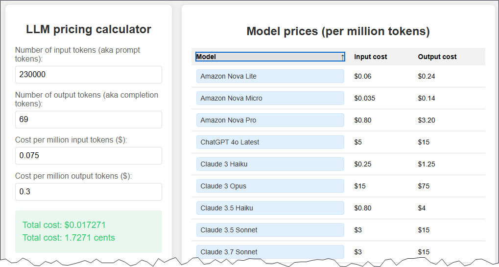

# ttok

**`ttok`** è un altro strumento creato da **Simon Willison**, per contare il numero di token di un testo e/o troncarlo in base a un numero desiderato di questi.

!!! note "Cosa sono i token?"

    I **token** sono le unità base in cui gli LLM suddividono il testo per elaborarlo. Un token può essere una parola intera, parte di una parola, un carattere di punteggiatura o anche uno spazio. Ad esempio, la frase "Ciao mondo!" potrebbe essere divisa in 3 token: "Ciao", " mondo", "!".

È fondamentale conoscere il numero di token perché i modelli LLM hanno un limite massimo di token che possono elaborare, in input e output. Inoltre il **costo** dell'**utilizzo** di un modello LLM è spesso calcolato in base al numero di token elaborati.

`ttok` è scritto in Python e si può installare con `pip` o con `uv`:

```bash
pip install ttok
```

```bash
uv tool install ttok
```

Il modello di default utilizzato per il conteggio dei token è quello di GPT-3.5 e GPT-4.

## Utilizzo

### Base

Il comando base si può lanciare così:

```bash
ttok Ciao mondo
```

In output si ottiene il numero di token:

```bash
3
```

Oppure è possibile fargli leggere l'output di un comando, come ad esempio `curl` e conteggiare il numero di token della pagina web su Wikipedia dedicata a Aaron Swartz:

```bash
curl -kL 'https://en.wikipedia.org/wiki/Aaron_Swartz' | ttok
```

In questo caso si hanno circa `230.000` token di output. Questo si può passare a un `LLM` tramite [`llm` cli](../llm_cli/index.md) per chiedere di riassumere il testo per un messaggio da inviare in chat:

```
curl -kL 'https://en.wikipedia.org/wiki/Aaron_Swartz' | \
llm "mi scrivi un messaggio breve per stimolare le persone a scoprire chi è Aaron. Lo invierò in chat" | ttok
```

In output si ottiene qualcosa come il testo di sotto, che è lungo circa `70` token:

```text {. }
Hai mai sentito parlare di Aaron Swartz? 🤔 Era un genio, un attivista e un pioniere del web. La sua storia è incredibile e ti farà riflettere sul futuro di internet e della conoscenza. Scoprilo anche tu! 😉"
```

Conoscendo il numero di token di input e di output, in base al modello di LLM scelto, si può calcolare il [costo del servizio](#costo-dei-modelli-llm-per-numero-di-token).

### Troncare il testo a un certo numero di token

Se si vuole troncare il testo a un certo numero di token, si può usare l'opzione `-t` seguita dal numero di token desiderato. Ad esempio, per troncare il testo a `10` token:

```bash
ttok -t 10 "Ciao mondo, questo è un testo di esempio che voglio troncare a dieci token."
```

In output si ottiene il testo troncato:

```text {.wordwrap-code }
Ciao mondo, questo è un testo di
```

### Visualizzare i token

Per visualizzare i token di un testo, si può usare l'opzione `--encode`:

```bash
ttok "Ciao mondo, questo è un testo di esempio" --encode
```

In output si ottengono gli ID dei token (dei 13 token del testo di esempio):

```text
34 23332 70809 11 34560 11676 653 1296 78 1891 1560 3342 822
```

Per convertire questi ID in testo leggibile, si può usare l'opzione `--decode`:

```bash
ttok "34 23332 70809 11 34560 11676 653 1296 78 1891 1560 3342 822" --decode
```

## Costo dei modelli LLM per numero di token

Simon Willison - è sempre bene rinnovare una volta al giorno **grazie Simon** -  ha realizzato un [calcolatore di costi per token e modello](https://www.llm-prices.com/), che permette di calcolare il costo del servizio.

[](https://www.llm-prices.com)
