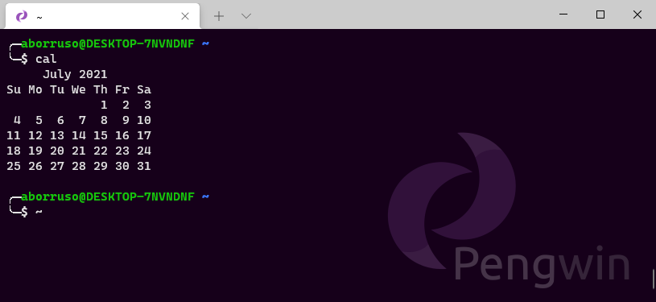

---
hide:
  - navigation
---

# La CLI

La **riga di comando** - in inglese **CLI**, la *Command Line Intereface* - è un'interfaccia di dialogo **testuale** tra utente e *computer*, ed anche un programma, che interpreta i comandi inseriti da tastiera e li esegue.

Esistono decine di interfacce a riga di comando, per tutti i sistemi operativi. Qui si farà riferimento a una generica CLI in un sistema operativo Linux. 
È possibile attivarla in tutti i sistemi operativi: Linux (ovviamente), Mac OS (che è basato su un sistema operativo Unix), Windows (il modo consigliato per Win è [Windows Subsystem for Linux](https://docs.microsoft.com/en-us/windows/wsl/install-win10)), ChromeOS, ecc..

