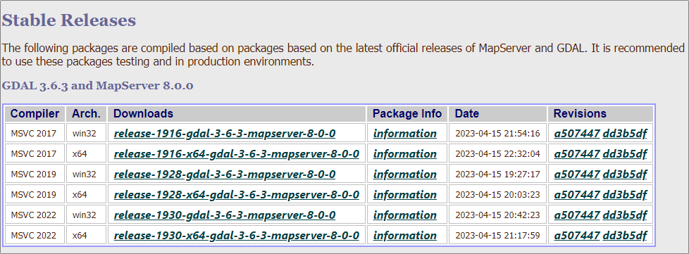

## Compilazione

### Ambiente LINUX

Si inizia da installare le dipendenze:


```bash
sudo apt-get install swig
sudo apt-get install build-essential
sudo apt-get install cmake
sudo apt-get install libproj-dev proj-data proj-bin unzip -y
sudo apt install curl && sudo apt-get install libcurl4-openssl-dev
sudo apt-get install libcrypto++-dev libcrypto++-doc libcrypto++-utils
sudo apt install libgeos-dev
```

Poi, a partire da una cartella di lavoro, si clona il *repository* ufficiale (è necessario avere `git` installato) e si compila seguendo questi passi:


```bash
git clone https://github.com/OSGeo/gdal.git
cd gdal
mkdir build
cd build

cmake  GDAL_USE_GEOS=ON ..
cmake --build .
sudo cmake --build . --target install
```

## Installazione

### Windows

Un modo per farlo è quello di utilizzare i pacchetti precompilati disponibili su [GISInternals](https://www.gisinternals.com/).

Questi i passi:

- si sceglie la *release* desiderata (ad esempio la stabile);
- poi architettura e "compilatore" (quindi ad esempio, `x64` e `MSVC 2022`);
- si apre pagina relativa (ad esempio `release-1930-x64-gdal-3-6-3-mapserver-8-0-0`) e si sceglie la voce che in descrizione riporta "*Compiled binaries in a single .zip package*" e si fa il relativo *download*;
- si estrae il file zip scaricato in una cartella del PC (ad esempio `C:\gdal`).



L'installazione è terminata. Per usare GDAL, basterà lanciare la *shell* relativa, facendo click sul file `SDKShell.bat` (presente nella radice della cartella dei file estratti).
