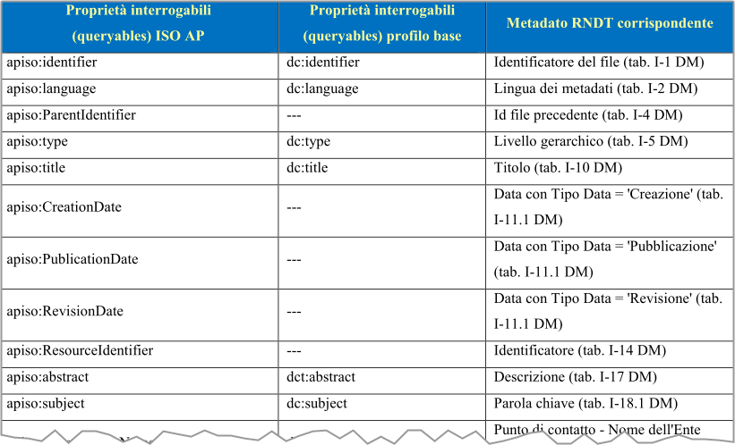

# Ricette GDAL/OGR

## Scaricare dati da un webservice ArcGIS

Prima lo interrogo, per avere restituito il nome del layer e altri metadati:

```
ogrinfo -so -ro -al "https://map.sitr.regione.sicilia.it/gis/rest/services/catasto/cartografia_catastale/MapServer/6/query?where=objectid+%3D+objectid&outfields=*&f=json"
```

L'output sarà qualcosa come:

```
Layer name: ESRIJSON
Geometry: Polygon
Feature Count: 1000
Extent: (13.097299, 37.166626) - (13.976281, 37.694915)
Layer SRS WKT:
PROJCS["ETRS89 / UTM zone 33N",
    GEOGCS["ETRS89",
        DATUM["European_Terrestrial_Reference_System_1989",
            SPHEROID["GRS 1980",6378137,298.257222101,
                AUTHORITY["EPSG","7019"]],
            TOWGS84[0,0,0,0,0,0,0],
            AUTHORITY["EPSG","6258"]],
        PRIMEM["Greenwich",0,
            AUTHORITY["EPSG","8901"]],
        UNIT["degree",0.0174532925199433,
            AUTHORITY["EPSG","9122"]],
        AUTHORITY["EPSG","4258"]],
    PROJECTION["Transverse_Mercator"],
    PARAMETER["latitude_of_origin",0],
    PARAMETER["central_meridian",15],
    PARAMETER["scale_factor",0.9996],
    PARAMETER["false_easting",500000],
    PARAMETER["false_northing",0],
    UNIT["metre",1,
        AUTHORITY["EPSG","9001"]],
    AXIS["Easting",EAST],
    AXIS["Northing",NORTH],
    AUTHORITY["EPSG","25833"]]
OBJECTID: Integer (0.0)
COMUNE: String (4.0)
SEZIONE: String (1.0)
FOGLIO: String (4.0)
ALLEGATO: String (1.0)
SVILUPPO: String (1.0)
ORIGINE: String (20.0)
Shape_Length: Real (0.0)
Shape_Area: Real (0.0)
```

E poi, lo scarico paginando

```
ogr2ogr -overwrite -f SQLite -dsco SPATIALITE=YES -nlt MULTIPOLYGON -nln particelle particelle.sqlite  "https://map.sitr.regione.sicilia.it/gis/rest/services/catasto/cartografia_catastale/MapServer/6/query?where=objectid+%3D+objectid&outfields=*&f=json" ESRIJSON -lco FEATURE_SERVER_PAGING="YES"
```

Nota: `-nlt MULTIPOLYGON` perché l'oggetto di input qui è un `MULTIPOLYGON`.

## Usare gdal via docker

Si inizia con il prelevare l'immagine da un repository. Ad esempio questa di osgeo:

```bash
docker pull osgeo/gdal:alpine-normal-latest
```

E poi si può lanciare in modo **non interattivo** dalla propria shell:

```bash
docker run --rm -v "$(pwd)":/data osgeo/gdal:alpine-normal-latest gdalinfo data/input.tif
```

- `--rm` per rimuovere il container non appena si esce da esso;
- `-v` per specificare i volumi da montare nell'*host* e nel *container* `/from/host/:/on/container`

Nell'esempio di sopra sto montando la cartella corrente dell'*host* e la cartella `data` del *container*.

In **modo interattivo**, invece il comando diventa:

```bash
docker run -ti --rm -v "$(pwd)":/data osgeo/gdal:alpine-normal-latest /bin/sh
```

Si usa in questo esempio `/bin/sh`, perché lanciando l'`inspect` dell'immagine - `docker inspect osgeo/gdal:alpine-normal-latest` - si ha (vedi [qui](https://stackoverflow.com/a/29535285/757714)):

```json
"Cmd": [
    "/bin/sh",
    "-c",
    "#(nop) COPY dir:bfa76ede215e381fc0e06a919358cf3fe603fbc832802559c2e82eeec03e484d in /usr/ "
]
```

## Interrogare un server CSW

Se si vuole interrogare ad esempio il [server CSW](https://geodati.gov.it/geoportale/strumenti/2015-04-21-22-41-05) del Repertorio Nazionale dei Dati Territoriali, l'URL di riferimento è <http://geodati.gov.it/RNDT/csw>

Se si vuole l'elenco di tutti gli *item*, che contengono nel `subject` il valore `salute`, si può lanciare questo comando:

```bash
ogrinfo -ro -al "CSW:http://geodati.gov.it/RNDT/csw" -where "subject LIKE 'salute'"
```

Si avrà a schermo l'elenco degli *item*.

!!! note "Nota"
    La ricerca viene eseguita non per stringa esatta, ma per tutto ciò che contiene nel `subject` la stringa `salute`. Per **ricerche di stringhe esatte**, leggere il [paragrafo di sotto](#query-basate-su-elenco-di-parole-mappate-come-stringa-esatta).

Se si vuole l'output di questa *query* in CSV, si può usare `ogr2ogr`:

```bash
ogr2ogr -F csv tmp.csv "CSW:http://geodati.gov.it/RNDT/csw" -where "subject LIKE 'salute'" -oo ELEMENTSETNAME=full -oo FULL_EXTENT_RECORDS_AS_NON_SPATIAL=YES -oo MAX_RECORDS=500 --config GML_SKIP_CORRUPTED_FEATURES YES
```

Se si vuole leggere il comando che ogr invia al server, bisogna attivare il debug, con `--debug on`:

```bash
ogrinfo --debug on -ro -al "CSW:http://geodati.gov.it/RNDT/csw" -where "subject LIKE 'salute'"
```

In output si leggeranno i dettagli delle chiamate HTTP:

```
HTTP: Fetch(http://geodati.gov.it/RNDT/csw)
HTTP: These POSTFIELDS were sent:<?xml version="1.0" encoding="UTF-8"?><csw:GetRecords resultType="results" service="CSW" version="2.0.2" startPosition="73" maxRecords="500" xmlns:csw="http://www.opengis.net/cat/csw/2.0.2" xmlns:gml="http://www.opengis.net/gml" xmlns:dc="http://purl.org/dc/elements/1.1/" xmlns:dct="http://purl.org/dc/terms/" xmlns:ogc="http://www.opengis.net/ogc" xmlns:ows="http://www.opengis.net/ows" xmlns:xsi="http://www.w3.org/2001/XMLSchema-instance" xsi:schemaLocation="http://www.opengis.net/cat/csw/2.0.2 http://schemas.opengis.net/csw/2.0.2/CSW-discovery.xsd"><csw:Query typeNames="csw:Record"><csw:ElementSetName>full</csw:ElementSetName><csw:Constraint version="1.1.0"><ogc:Filter><ogc:PropertyIsLike wildCard='*' singleChar='_' escapeChar='!'><ogc:PropertyName>dc:subject</ogc:PropertyName><ogc:Literal>salute</ogc:Literal></ogc:PropertyIsLike></ogc:Filter></csw:Constraint></csw:Query></csw:GetRecords>
HTTP: These HTTP headers were set: Content-Type: application/xml; charset=UTF-8
```

La query è descritta in XML:

```xml
<?xml version="1.0" encoding="UTF-8"?>
<csw:GetRecords resultType="results" service="CSW" version="2.0.2" startPosition="1" maxRecords="500" xmlns:csw="http://www.opengis.net/cat/csw/2.0.2" xmlns:gml="http://www.opengis.net/gml" xmlns:dc="http://purl.org/dc/elements/1.1/" xmlns:dct="http://purl.org/dc/terms/" xmlns:ogc="http://www.opengis.net/ogc" xmlns:ows="http://www.opengis.net/ows" xmlns:xsi="http://www.w3.org/2001/XMLSchema-instance" xsi:schemaLocation="http://www.opengis.net/cat/csw/2.0.2 http://schemas.opengis.net/csw/2.0.2/CSW-discovery.xsd">
  <csw:Query typeNames="csw:Record">
    <csw:ElementSetName>full</csw:ElementSetName>
    <csw:Constraint version="1.1.0">
      <ogc:Filter>
        <ogc:PropertyIsLike wildCard='*' singleChar='_' escapeChar='!'>
          <ogc:PropertyName>dc:subject</ogc:PropertyName>
          <ogc:Literal>salute</ogc:Literal>
        </ogc:PropertyIsLike>
      </ogc:Filter>
    </csw:Constraint>
  </csw:Query>
</csw:GetRecords>
```

Questa consente di costruire una semplice chiamata `HTTP` in `curl`:

```bash
curl -s -k -X POST -H "Content-Type: application/xml; charset=UTF-8" -d '<?xml version="1.0" encoding="UTF-8"?><csw:GetRecords resultType="results" service="CSW" version="2.0.2" startPosition="1" maxRecords="500" xmlns:csw="http://www.opengis.net/cat/csw/2.0.2" xmlns:gml="http://www.opengis.net/gml" xmlns:dc="http://purl.org/dc/elements/1.1/" xmlns:dct="http://purl.org/dc/terms/" xmlns:ogc="http://www.opengis.net/ogc" xmlns:ows="http://www.opengis.net/ows" xmlns:xsi="http://www.w3.org/2001/XMLSchema-instance" xsi:schemaLocation="http://www.opengis.net/cat/csw/2.0.2 http://schemas.opengis.net/csw/2.0.2/CSW-discovery.xsd"><csw:Query typeNames="csw:Record"><csw:ElementSetName>full</csw:ElementSetName><csw:Constraint version="1.1.0"><ogc:Filter><ogc:PropertyIsLike wildCard="*" singleChar="_" escapeChar="!"><ogc:PropertyName>dc:subject</ogc:PropertyName><ogc:Literal>salute</ogc:Literal></ogc:PropertyIsLike></ogc:Filter></csw:Constraint></csw:Query></csw:GetRecords>' https://geodati.gov.it/RNDT/csw
```

Alcune note su questo comando:

- nel debug di ogr si legge `<ogc:PropertyIsLike wildCard='*' singleChar='_' escapeChar='!'>`. Nel comando curl di sopra, bisogna modificare gli `'` in `"`;
- `startPosition` è impostato a `"1"` per avere tutti i risultati a partire dal primo;
- `resultType` impostato a `"results"` dà in output le informazioni su tutti gli item di output.

Se si vuole avere in output soltanto un riepilogo dei risultati, bisognerà cambiare `resultType` in `"hits"`:

```bash
curl -s -k -X POST -H "Content-Type: application/xml; charset=UTF-8" -d '<?xml version="1.0" encoding="UTF-8"?><csw:GetRecords resultType="hits" service="CSW" version="2.0.2" startPosition="1" maxRecords="500" xmlns:csw="http://www.opengis.net/cat/csw/2.0.2" xmlns:gml="http://www.opengis.net/gml" xmlns:dc="http://purl.org/dc/elements/1.1/" xmlns:dct="http://purl.org/dc/terms/" xmlns:ogc="http://www.opengis.net/ogc" xmlns:ows="http://www.opengis.net/ows" xmlns:xsi="http://www.w3.org/2001/XMLSchema-instance" xsi:schemaLocation="http://www.opengis.net/cat/csw/2.0.2 http://schemas.opengis.net/csw/2.0.2/CSW-discovery.xsd"><csw:Query typeNames="csw:Record"><csw:ElementSetName>full</csw:ElementSetName><csw:Constraint version="1.1.0"><ogc:Filter><ogc:PropertyIsLike wildCard="*" singleChar="_" escapeChar="!"><ogc:PropertyName>dc:subject</ogc:PropertyName><ogc:Literal>salute</ogc:Literal></ogc:PropertyIsLike></ogc:Filter></csw:Constraint></csw:Query></csw:GetRecords>' https://geodati.gov.it/RNDT/csw
```

In output

```xml
<?xml version="1.0" encoding="UTF-8"?>
<csw:GetRecordsResponse xmlns:csw="http://www.opengis.net/cat/csw/2.0.2" xmlns:dc="http://purl.org/dc/elements/1.1/" xmlns:dcmiBox="http://dublincore.org/documents/2000/07/11/dcmi-box/" xmlns:dct="http://purl.org/dc/terms/" xmlns:gml="http://www.opengis.net/gml" xmlns:ows="http://www.opengis.net/ows" xmlns:xsd="http://www.w3.org/2001/XMLSchema">
  <csw:SearchStatus timestamp="2022-11-17T11:34:46+01:00" />
  <csw:SearchResults elementSet="full" nextRecord="1" numberOfRecordsMatched="72" numberOfRecordsReturned="0" recordSchema="http://www.opengis.net/cat/csw/2.0.2" />
</csw:GetRecordsResponse>
```

È possibile anche usare un carattere *jolly* e fare ricerche per tutti gli item, che contengono la stringa `salut`. Il caratter `jolly` è `*`.

Il comando

```
ogrinfo -ro -al "CSW:http://geodati.gov.it/RNDT/csw" -where "subject LIKE '*salut*'"
```

restituirà quindi anche gli item con subject `rischio per la salute`, `Centri salute mentale`, `ambiente e salute`, ecc..

### Elenco dei campi interrogabili

Si ottiene lanciando `ogrinfo CSW:http://www.pcn.minambiente.it/geoportal/csw -al -so`. In output, in basso, l'elenco dei campi interrogabili e il loro tipo:

```
INFO: Open of `CSW:http://www.pcn.minambiente.it/geoportal/csw'
      using driver `CSW' successful.

Layer name: records
Geometry: Polygon
Feature Count: 329
Extent: (-180.000000, -90.000000) - (180.000000, 90.000000)
Layer SRS WKT:
GEOGCS["WGS 84",
    DATUM["WGS_1984",
        SPHEROID["WGS 84",6378137,298.257223563,
            AUTHORITY["EPSG","7030"]],
        AUTHORITY["EPSG","6326"]],
    PRIMEM["Greenwich",0,
        AUTHORITY["EPSG","8901"]],
    UNIT["degree",0.0174532925199433,
        AUTHORITY["EPSG","9122"]],
    AUTHORITY["EPSG","4326"]]
Geometry Column = boundingbox
identifier: String (0.0)
other_identifiers: StringList (0.0)
type: String (0.0)
subject: String (0.0)
other_subjects: StringList (0.0)
references: String (0.0)
other_references: StringList (0.0)
modified: String (0.0)
abstract: String (0.0)
date: String (0.0)
language: String (0.0)
rights: String (0.0)
format: String (0.0)
other_formats: StringList (0.0)
creator: String (0.0)
source: String (0.0)
anytext: String (0.0)
```

### Query in AND e OR

Ad esempio tutti gli item che hanno come *subject* `salute` e `strutture`:

```bash
ogrinfo -ro -al "CSW:http://geodati.gov.it/RNDT/csw" -where "subject LIKE 'salute' AND subject LIKE 'strutture'"
```

Si può applicare anche la condizione `OR`.

### Query basate su elenco di parole, mappate come stringa esatta

Se il subject che si vuole filtrare è `strutture sociali`, bisogna inserire questa stringa tra `"`.

Se non lo si fa, la ricerca verrà fatta in `OR`, ovvero tutti gli item con `subject="strutture"` o `subject="sociali"`.

Al momento (17 novembre 2022) c'è un bug, per cui non si può usare direttamente ogr, e quindi bisogna fare la cosa tramite chiamata HTTP diretta:

```bash
curl -s -k -X POST -H "Content-Type: application/xml; charset=UTF-8" -d '<?xml version="1.0" encoding="UTF-8"?><csw:GetRecords resultType="hits" service="CSW" version="2.0.2" startPosition="1" maxRecords="500" xmlns:csw="http://www.opengis.net/cat/csw/2.0.2" xmlns:gml="http://www.opengis.net/gml" xmlns:dc="http://purl.org/dc/elements/1.1/" xmlns:dct="http://purl.org/dc/terms/" xmlns:ogc="http://www.opengis.net/ogc" xmlns:ows="http://www.opengis.net/ows" xmlns:xsi="http://www.w3.org/2001/XMLSchema-instance" xsi:schemaLocation="http://www.opengis.net/cat/csw/2.0.2 http://schemas.opengis.net/csw/2.0.2/CSW-discovery.xsd"><csw:Query typeNames="csw:Record"><csw:ElementSetName>full</csw:ElementSetName><csw:Constraint version="1.1.0"><ogc:Filter><ogc:PropertyIsLike wildCard="*" singleChar="_" escapeChar="!"><ogc:PropertyName>dc:subject</ogc:PropertyName><ogc:Literal>"strutture sociali"</ogc:Literal></ogc:PropertyIsLike></ogc:Filter></csw:Constraint></csw:Query></csw:GetRecords>' https://geodati.gov.it/RNDT/csw
```

Notare che qui soprà è stato inserito `<ogc:Literal>"strutture sociali"</ogc:Literal>`.

### Cercare per titolo (title)

!!! note "Nota bene"

    Quanto scritto sotto, **da dicembre 2022**, non è più valido: a seguito di [questa segnalazione](https://github.com/OSGeo/gdal/issues/6718#issue-1451880195) e di [questa modifica al codice](https://github.com/OSGeo/gdal/pull/6912) **in GDAL/OGR è possibile fare ricerche CSW per titolo**. Si lascia in ogni caso questa sezione, perché è un buon esempio di *query HTTP*.


Come si vede [sopra](#elenco-dei-campi-interrogabili) il campo `title` non è di quelli ricercabili tramite OGR (vedi issue [6718](https://github.com/OSGeo/gdal/issues/6718)).

Quindi la ricerca per titolo è fattibile soltanto tramite una *query* HTTP sul server CSW, utilizzando il nome del campo disponibile.<br>
Nella [guida](https://geodati.gov.it/geoportale/images/RNDT_guida_operativa_csw_v2.0_20140725.pdf) al servizio CSW usato per questi esempi è presenta la lista dei campi, e si può fare riferimento al campo `title` usando `apiso:title` o `dc:title`.



La query di sotto cerca la stringa `salute` nel `title` (che in questo server è mappato come `dc:title`):

```bash
curl -s -k -X POST -H "Content-Type: application/xml; charset=UTF-8" -d '<?xml version="1.0" encoding="UTF-8"?><csw:GetRecords resultType="results" service="CSW" version="2.0.2" startPosition="1" maxRecords="500" xmlns:csw="http://www.opengis.net/cat/csw/2.0.2" xmlns:gml="http://www.opengis.net/gml" xmlns:dc="http://purl.org/dc/elements/1.1/" xmlns:dct="http://purl.org/dc/terms/" xmlns:ogc="http://www.opengis.net/ogc" xmlns:ows="http://www.opengis.net/ows" xmlns:xsi="http://www.w3.org/2001/XMLSchema-instance" xsi:schemaLocation="http://www.opengis.net/cat/csw/2.0.2 http://schemas.opengis.net/csw/2.0.2/CSW-discovery.xsd"><csw:Query typeNames="csw:Record"><csw:ElementSetName>full</csw:ElementSetName><csw:Constraint version="1.1.0"><ogc:Filter><ogc:PropertyIsLike wildCard="*" singleChar="_" escapeChar="!"><ogc:PropertyName>dc:title</ogc:PropertyName><ogc:Literal>salute</ogc:Literal></ogc:PropertyIsLike></ogc:Filter></csw:Constraint></csw:Query></csw:GetRecords>' https://geodati.gov.it/RNDT/csw
```

!!! note "Nota"

    La ricerca senza virgolette dà in output l'elenco di tutti gli *item* che contengono la parola `salute`, quindi restituisce anche `Centri salute mentale`. Se si vuole fare una ricerca esatta, bisogna mettere la stringa tra virgolette. Ad esempio `<ogc:Literal>"salute"</ogc:Literal>`

## Comprimere una base raster, con perdita, ma senza che sia "visibile"

È una compressione *lossy*, di cui la "perdita" è pressoché impercettibile ad occhio.<br>
Da applicare soltanto se la raster è da usare come sfondo, non da sottoporre ad analisi, in cui una varizione dei valori dei pixel non è un problema.

```bash
gdal_translate \
-b 1 -b 2 -b 3 \
-co COMPRESS=JPEG \
-co JPEG_QUALITY=75 \
-co PHOTOMETRIC=YCBCR \
-co TILED=YES \
input.tif output.tif
```

E per rendere la visualizzazione molto più rapida è essenziale aggiungere i tasselli compressi, a varie scale di zoom, con `gdaladdo`:

```bash
gdaladdo \
--config COMPRESS_OVERVIEW JPEG \
--config JPEG_QUALITY_OVERVIEW 50 \
--config PHOTOMETRIC_OVERVIEW YCBCR \
--config INTERLEAVE_OVERVIEW PIXEL \
-r average \
output.tif
```

Fonte: <http://blog.cleverelephant.ca/2015/02/geotiff-compression-for-dummies.html>

!!! note "Se sai che la TIFF di output sarà molto grande"

    Il limite dimensionale di un file TIFF è 4 GB. Per fare in modo che GDAL produca output più grandi, bisogna aggiungere l'opzione `-co BIGTIFF=YES` in `gdal_translate`; se si vuole applicare anche nella piramidazione invece è `--config BIGTIFF_OVERVIEW YES` in `gdaladdo`.

## Usare tutti i processori disponibili

Basta aggiungere il parametro `-co NUM_THREADS=ALL_CPUS`.

## Fare una piramidazione su file esterno

Di _default_ la piramidazione crea le piramidi all'interno del file a cui è applicata.

Se si vogliono inserire in un file esterno bisogno aggiungere l'opzione `-ro`, che imposta il _read only_ sul file di input (se il file non è "scrivibile" da `gdaladdo`, `-ro` si può omettere, e la piramidiazione avrà luogo esternamente).

```bash
gdaladdo -ro --config COMPRESS_OVERVIEW DEFLATE input.ecw
```
