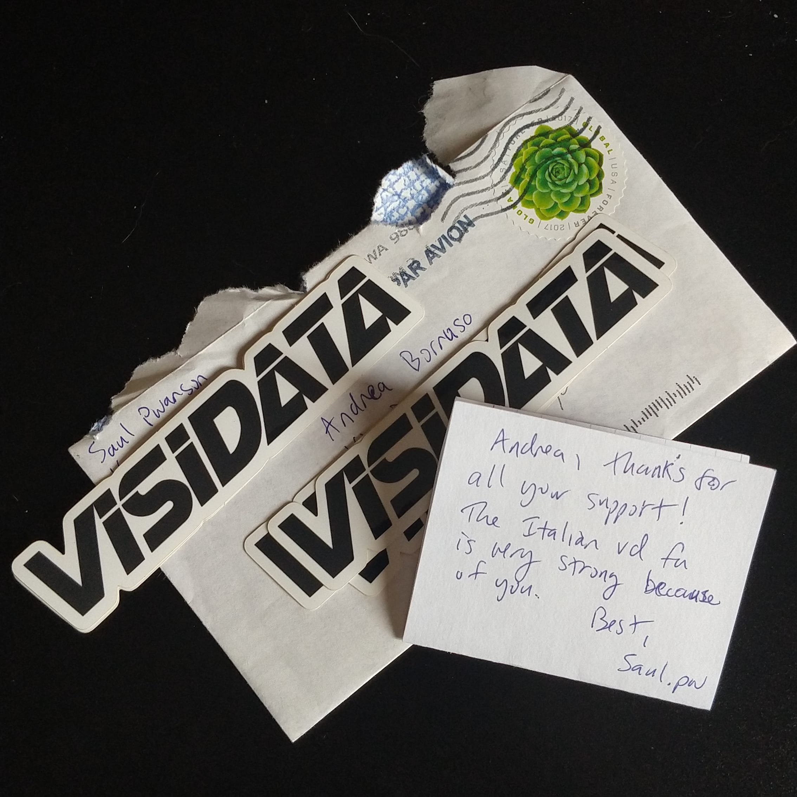

# VisiData: il coltellino svizzero per i dati, che probabilmente non conosci

> **VisiData** è un fantastico strumento _open source_ per esplorare e manipolare dati. Mette insieme la chiarezza di un **foglio di calcolo**, con l'efficienza del **terminale** e la potenza di **Python**, in una _utility_ leggera in grado di gestire milioni di righe con facilità.

In **onData** gli abbiamo dedicato un guida.

[Leggi la guida :fontawesome-solid-book-reader:](#){ .md-button .md-button--primary }
